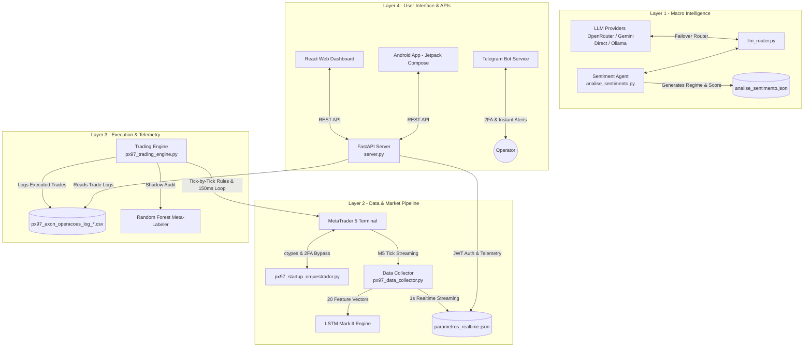

# 🤖 PX97-Axon — Automated Quantitative Trading System & Hybrid AI Architecture


> 🌐 **Portfolio & Architectural Showcase**  
> *This repository presents the technical architecture, machine learning pipeline, and audited 11-month performance report of the PX97-Axon quantitative trading system. Source code is proprietary and protected.*

---

## 📌 Executive Summary

**PX97-Axon** is an autonomous, high-availability quantitative trading ecosystem designed for the Brazilian Future Market (Mini-Índice Bovespa - WIN). 

Developed in Python, the project was engineered to overcome human behavioral bias and emotional decision-making in high-frequency environments. It combines a **hybrid artificial intelligence pipeline** (LLMs for macro news sentiment + LSTM Recurrent Neural Networks for time-series price prediction) with a **decoupled microservices architecture** and strict quantitative risk controls.

---

## 📊 Audited 11-Month Performance Summary

The performance of the system was audited over **11 operational months in real production** (August 8, 2025 to July 10, 2026, excluding March 2026 reserved for manual parameter calibration):

| Metric | Dynamic Lote Management (1-3 Lotes) | Static 5-Lote Simulation |
| :--- | :---: | :---: |
| **Total Evaluated Trades** | **318 trades** | **318 trades** |
| **Net Accumulated Profit** | **R$ 10.090,60** | **R$ 34.383,21** |
| **Financial Win Rate** | **60.1%** | **61.3%** |
| **Profit Factor (Fator de Lucro)** | **2.11** | **2.14** |
| **Max Static Drawdown** | **R$ -90,40** | **R$ -342,00** |
| **Max Trailing Drawdown** | R$ 591,58 | R$ 1.498,38 |
| **Average Profit per Trade** | R$ 31,73 | R$ 108,12 |
| **Return on Minimum Margin (R$ 500/lote)** | **2,018.1%** | **1,375.3%** |

> 📄 **Official Report Document:** Download the complete PDF report: [relatorio_desempenho_axon.pdf](./relatorio_desempenho_axon.pdf).

---

## 🏗️ Decoupled Microservices Architecture

To achieve **99.9% uptime and zero Single Point of Failure (SPoF)**, the ecosystem was structured into 5 independent, asynchronous background processes communicating via lightweight state files:



---

## 🧠 Hybrid Artificial Intelligence Stack

```text
┌────────────────────────────────────────────────────────────────────────┐
│                        HYBRID AI PIPELINE                              │
├────────────────────────────────────────────────────────────────────────┤
│ 1. Macro LLM Sentinel   ──► Analyzes news & sets Regime (Agressivo)    │
│ 2. Predictive LSTM      ──► 60-candle window & 20 Technical Features     │
│ 3. Shadow Meta-Labeler  ──► Parallel Random Forest Audit (No Blocking) │
└────────────────────────────────────────────────────────────────────────┘
```

1. **Macro LLM Sentiment Sentinel (`analise_sentimento.py` + `llm_router.py`)**:
   * Scrapes global and domestic B3 financial news.
   * Evaluates raw score ($-10 \text{ to } +10$) and confidence level.
   * Sets dynamic operational regimes (`AGRESSIVO`, `NORMAL`, `DEFENSIVO`) and recalibrates thresholds, ATR gain/stop multipliers, and lot sizes.
2. **LSTM Mark II Predictive Engine (`px97_data_collector.py` + `px97_trading_engine.py`)**:
   * Deep Recurrent Neural Network trained on 60-candle lookback windows.
   * Evaluates a strict 20-feature vector (RSI, ADX, MACD, Bollinger Bands, ATR, OBV, Log Returns, and Sine/Cosine Time Encoding).
   * Executes orders **instantaneously tick-by-tick** upon signal approval.
3. **Random Forest Meta-Labeler (`modelo_auxiliar.py` - Shadow Mode)**:
   * Operates asynchronously in *Shadow Mode* without order-blocking authority.
   * Audits trade signals in real time to generate cross-validation metrics for future model retraining.

---

## 🛡️ Risk Management & Prop Firm Compliance

* **Dynamic ATR Volatility Execution:** Take-profit and stop-loss targets dynamically adjust to market ATR ($1.45\times \text{ to } 1.68\times \text{ ATR}$).
* **Minimum Balance Safety Lock (`TRAVA_SALDO_MINIMO`):** Enforces 1-contract lot limit if account balance drops below R$ 1,200.00.
* **Timedrop Exit Protocol:** Forces trade liquidation if position duration exceeds maximum time window (106 minutes).
* **Prop Firm Drawdown Validation:** Under static drawdown rules (e.g., Axia Investing), the account maintained a maximum static drawdown of only **R$ -90.40** (Dynamic) and **R$ -342.00** (5 Contratos), easily satisfying evaluation criteria with over 70% safety buffer.

---

## 📜 Intellectual Property & Copyright Notice

**Copyright (C) July 13, 2025 – 2026, José Landy Giorio do Vale. All Rights Reserved.**

This repository is published solely for demonstration, architectural review, and portfolio showcase purposes. All source code, neural network weight files, datasets, and proprietary algorithms are strictly confidential and protected by intellectual property laws.
