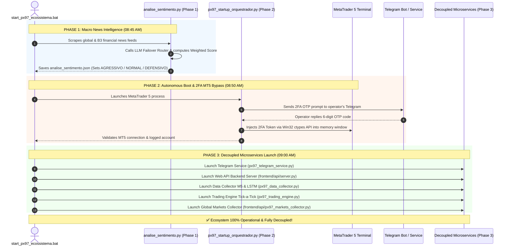
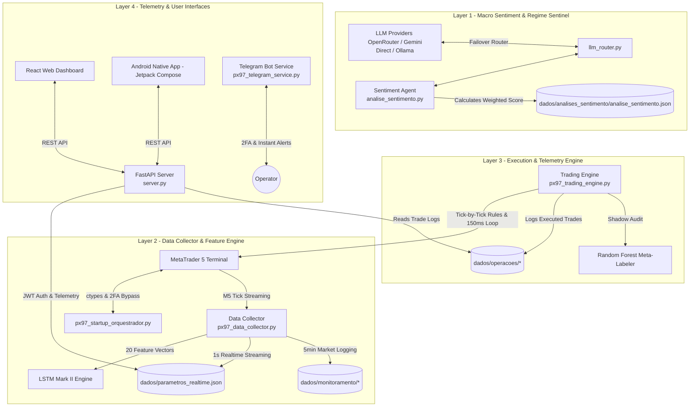

# 🤖 PX97-Axon — Automated Quantitative Trading System & Hybrid AI Architecture


> 🌐 **Institutional Portfolio & Architectural Showcase**  
> *This repository presents the system architecture, multi-agent AI pipeline, security protocols, user interfaces, and audited 11-month production telemetry of the PX97-Axon quantitative trading ecosystem. All source code, neural network weight files, and commercial algorithms remain proprietary and protected.*

---

## 💡 1. Motivation & Engineering Vision (Why This System Was Built)

Trading financial futures demands unwavering operational discipline, rapid risk assessment, and sub-second execution speed — three areas where human psychology consistently falters under stress, cognitive fatigue, or emotional hesitation.

**PX97-Axon** was initiated in **July 2025** as a dedicated software engineering project: **to design a fully autonomous, high-availability quantitative trading ecosystem capable of eliminating human behavioral bias from real-time market execution.**

Rather than attempting to manage human emotional friction during extreme volatility, the architectural goal was to delegate decision-making to a mathematically rigorous, multi-layered machine learning pipeline. The system operates continuously under strict quantitative rules, dynamically re-calibrating risk parameters via Large Language Models (LLMs) based on macro sentiment and executing orders tick-by-tick with zero hesitation.

---

## ⏳ 2. Ecosystem Evolutionary Timeline (July 2025 – August 2026)

Over **1 year of continuous engineering and 11 months of audited real production history**, PX97-Axon evolved through major architectural milestones:

```text
┌────────────────────────────────────────────────────────────────────────────────────────┐
│                          PROJECT EVOLUTIONARY TIMELINE                                 │
├────────────────────────────────────────────────────────────────────────────────────────┤
│ • July 2025         ──► Conception of Monolithic Prototype v1.0.0                     │
│ • Aug 2025 - May 26 ──► 11-Month Audited Real Production Telemetry Run (318 Trades)     │
│ • May 2026          ──► Release v1.0.0 Stable, Native Android Compose App & Dual Equity │
│ • June 2026         ──► Microservices Refactoring v1.4.0, Auto WIN Rollover v1.4.2     │
│ • June 2026 (cont.) ──► LLM Failover Router v1.4.7, 2FA MT5 Bypass via ctypes v1.5.0   │
│ • July - Aug 2026   ──► Daily Top Filter v1.6.0, Minimum Balance Lock v1.6.2 (Current) │
└────────────────────────────────────────────────────────────────────────────────────────┘
```

* **`July 2025` — Conception & Monolithic Prototype:** Core algorithmic trading engine built in Python to evaluate 5-minute Mini-Índice Bovespa (WIN) candles.
* **`August 2025 – May 2026` — Real Production Telemetry Run:** 11 operational months recorded in real market conditions, producing 318 audited trades with a **Profit Factor of 2.11** and a **Max Static Drawdown of only R$ -90.40**.
* **`May 2026` — Mobile Native Expansion & Visual Telemetry (`v1.1.0 – v1.2.0`):** Release of the native Android application (Kotlin / Jetpack Compose) with R8/ProGuard obfuscation, and implementation of the Dual Equity Curve chart (Currency R$ vs Points pts with independent Y-axes).
* **`June 2026` — Microservices Architectural Refactoring (`v1.4.0`):** Major structural refactoring separating the monolithic code into **5 independent asynchronous microservices**, eliminating Single Points of Failure (SPoF).
* **`June 2026` — Dynamic Contracts & Resilient LLM Routing (`v1.4.2 – v1.4.7`):** Automatic WIN contract rollover without system restarts, dynamic ADX/ATR exhaustion limits, and LLM cascading failover harness (OpenRouter $\rightarrow$ Gemini Direct $\rightarrow$ Ollama).
* **`June 2026` — Autonomous 2FA MT5 Bypass (`v1.5.0`):** Automation of MetaTrader 5 startup and graphical 2FA OTP handling via Telegram Bot and Windows `ctypes` API memory injection.
* **`July – August 2026` — Hardened Production Baseline (`v1.6.0 – v1.6.2`):** Implementation of the Daily Top Filter (RSI+ATR blend), Afternoon Low-Volatility ATR Filter, Sovereign Minimum Balance Safety Lock (`TRAVA_SALDO_MINIMO` @ R$ 1,200.00), and consolidation of the flagship portfolio showcase.

---

## 🔄 3. Chronological Daily Execution Sequence (The 3-Phase Operational Flow)

When the ecosystem initializes each trading day, it executes an automated **3-Phase Execution Sequence** ensuring intelligence calibration and connectivity before order-matching:



---

## 🏗️ 4. Decoupled Microservices Topology (v1.4.0 – v1.6.2)

To guarantee **99.9% operational uptime and zero Single Point of Failure (SPoF)**, the ecosystem operates as **5 independent microservices**. 

Communication between services is event-driven and synchronized via lightweight state files (`analise_sentimento.json`, `meta_trade.json`, `parametros_realtime.json`). If a secondary service (such as Telegram or the Web Dashboard) experiences network latency, **the core 150ms tick-by-tick trading engine continues executing on MetaTrader 5 without interruption.**



---

## 🧠 5. Multi-Agent Artificial Intelligence Stack

```text
┌────────────────────────────────────────────────────────────────────────┐
│                        HYBRID AI PIPELINE                              │
├────────────────────────────────────────────────────────────────────────┤
│ 1. Macro LLM Sentinel   ──► Analyzes news & sets Regime (AGRESSIVO)    │
│ 2. Predictive LSTM      ──► 60-candle window & 20 Technical Features     │
│ 3. Shadow Meta-Labeler  ──► Parallel Random Forest Audit (No Blocking) │
└────────────────────────────────────────────────────────────────────────┘
```

### Agent 1: Macro Sentiment & Regime Sentinel (`analise_sentimento.py` + `llm_router.py`)
* **Execution**: Scheduled at startup, at fixed 3-daily windows (Morning 08:45, Afternoon 13:00, Evening 18:00), and **reactively during volatility spikes** ($\ge 4.5\times \text{ATR}$).
* **Cascading Failover Harness**: `llm_router.py` automatically routes prompts across **OpenRouter (Gemini 2.5) $\rightarrow$ Gemini Direct API $\rightarrow$ Ollama Local**.
* **Mathematical Formula**: Computes the Weighted Sentiment Score:
  $$\text{Weighted Score} = \text{Raw Score (-10 to +10)} \times \text{Confidence Level (0.0 to 1.0)}$$
* **Dynamic Regimes**: Classifies market into `AGRESSIVO` ($\ge +4.5$), `NORMAL` ($-3.0 \text{ to } +4.5$), or `DEFENSIVO` ($< -3.0$), dynamically recalibrating thresholds, lot sizes, cooldowns, and ATR multipliers in `config.py`.

### Agent 2: Deep Recurrent Neural Network (`LSTM Mark II`)
* **Execution**: 5-minute candles with a 60-candle lookback window.
* **Strict Feature Vector**: Expects **exactly 20 features in strict order** to preserve Scaler `.pkl` normalization:

| # | Feature Name | Description |
| :-: | :--- | :--- |
| 1 | `volume` | Real-time tick volume |
| 2 | `SMA_10` | 10-period Simple Moving Average |
| 3 | `EMA_20` | 20-period Exponential Moving Average |
| 4 | `RSI_14` | 14-period Relative Strength Index |
| 5-7 | `MACD_12_26_9`, `MACDh`, `MACDs` | MACD Line, Histogram, and Signal Line |
| 8-12 | `BBL`, `BBM`, `BBU`, `BBB`, `BBP` | Bollinger Bands (Lower, Middle, Upper, Bandwidth, %P) |
| 13 | `ATRr_14` | 14-period Average True Range |
| 14 | `OBV` | On-Balance Volume |
| 15-18 | `hour_sin`, `hour_cos`, `day_sin`, `day_cos` | Cyclical Sine/Cosine Time Encodings |
| 19 | `log_ret` | Logarithmic Returns $\ln(C_t / C_{t-1})$ |
| 20 | `rsi` | Normalized RSI feature |

### Agent 3: Meta-Labeler in Shadow Mode (`modelo_auxiliar.py`)
* **Execution**: Asynchronous Random Forest classifier (`.joblib`) running parallel cross-auditing on every LSTM trade trigger without order-blocking authority. Logs telemetry (`prob_auxiliar`, `status_aux`) for long-term shadow testing.

---

## 🛡️ 6. Quantitative Risk Protocols & Capital Protection

```text
┌────────────────────────────────────────────────────────────────────────┐
│                   QUANTITATIVE RISK LAYERS                             │
├────────────────────────────────────────────────────────────────────────┤
│ • Minimum Balance Lock   ──► Capital < R$ 1,200 forces 1-contract lot  │
│ • Dynamic ATR Execution  ──► Stop & Take scaled by Volatility (ATR)    │
│ • Daily Top Filter       ──► Blocks BUY at daily highs (RSI>75, ATR>4.2)│
│ • ADX/ATR Exhaustion     ──► Blocks stretched entries > EMA20 boundary │
│ • Timedrop Liquidation   ──► Forces position exit after 106 minutes    │
│ • Equity Guard           ──► Locks profits if drawdown > 50% from peak │
└────────────────────────────────────────────────────────────────────────┘
```

1. **Sovereign Minimum Balance Safety Lock (`TRAVA_SALDO_MINIMO`):**  
   Sovereign rule in `config.py` / `funcoes.py` (v1.6.2). If account capital drops below **R$ 1,200.00**, the lot size is forcibly locked to **1 contract**, overriding any manual dashboard input to protect capital.
2. **Dynamic ATR Volatility Targets:**  
   Take-profit and Stop-loss targets automatically scale with market ATR ($1.45\times \text{ to } 1.68\times \text{ ATR}$):
   $$\text{Take Profit} = \text{Entry Price} + (\text{ATR} \times \text{GAIN\_Base})$$
   $$\text{Stop Loss} = \text{Entry Price} - (\text{ATR} \times \text{STOP\_Base})$$
3. **Daily Top Filter (v1.6.0):**  
   Blocks long entries at daily absolute highs if daily range percentile $\ge 98\%$, RSI $> 75.0$, and Range/ATR ratio $> 4.2$.
4. **ADX/ATR Exhaustion Boundary (v1.4.4):**  
   Prevents buying over-stretched prices when distance to EMA20 exceeds $\max(750, \text{ADX\_mult} \times \text{ATR})$. Inhibited during opening hour (09:00-10:00) to allow gap momentum capture.
5. **Timedrop Regressive Liquidation (v1.4.5):**  
   Monitors active trade duration. If a trade remains open past **106 minutes**, it is automatically liquidated to free capital and prevent overnight holding risk.
6. **Equity Guard:**  
   Enforces a daily profit lock. If intraday profit gives back $> 50\%$ from its peak (after reaching trigger threshold), trading is terminated for the day.

---

## 🔒 7. Security Architecture & User Interfaces

The ecosystem provides complete operational transparency through three dedicated, secured interfaces:

### 💻 React Neomorphic Web Dashboard (`frontend/`)
* **Technology**: React, TypeScript, TailwindCSS neomorphic components.
* **Features**: Real-time tick monitoring, dual equity curve chart, interactive checklist cards, 150ms parameter hot-reloading, and AI-generated performance reports.
* **Security**: Backend protected by FastAPI JWT Tokens with anti-bruteforce lockout and non-cached HTTP headers (`no-store, no-cache`).

### 📱 Native Android Mobile App (`mobile/`)
* **Technology**: Native Kotlin, Jetpack Compose, Material Design 3, Retrofit.
* **Features**: Real-time position tracking, dynamic SL/TP progress bars, partial profit indicators, release update popups, and instant alerts.
* **Security**: Hardened via **R8/ProGuard code obfuscation**, signed release certificates, and secure in-memory JWT/OTP token storage to prevent XSS/reverse-engineering.

### 🔐 Autonomous 2FA MT5 Boot Orchestrator (`px97_startup_orquestrador.py`)
* **Technology**: Python, Telegram Bot API, Windows `ctypes` API.
* **Function**: Automates MetaTrader 5 startup. Prompts the operator via Telegram for 2FA OTP, receives the 6-digit code, and injects the token via native Win32 memory APIs directly into the target GUI input field.

---

## 📊 8. Audited 11-Month Production Performance

The operational performance of the ecosystem was independently audited over **11 real production months** (August 8, 2025 to July 10, 2026, excluding March 2026 dedicated to parameter optimization and manual stress-testing) on the **Mini-Índice Bovespa (WIN)** futures market:

### 📈 Core Performance Audit Matrix

| Performance Metric | Dynamic Lote Management (1-3 Lotes) | Static 5-Lote Leverage Simulation |
| :--- | :---: | :---: |
| **Total Evaluated Trades** | **318 trades** | **318 trades** |
| **Net Accumulated Profit** | **R$ 10.090,60** | **R$ 34.383,21** |
| **Financial Win Rate** | **60.1%** | **61.3%** |
| **Profit Factor (Fator de Lucro)** | **2.11** | **2.14** |
| **Max Static Drawdown** | **R$ -90,40** | **R$ -342,00** |
| **Max Trailing Drawdown** | R$ 591,58 | R$ 1.498,38 |
| **Average Profit per Trade** | R$ 31,73 | R$ 108,12 |
| **Recommended Margin Allocation** | R$ 500,00 to R$ 1.500,00 | R$ 2.500,00 |
| **Return on Minimum Margin (R$ 500/lote)** | **2,018.1%** | **1,375.3%** |

---

## 🏛️ 9. Proprietary Trading Firm (Prop Firm) Compliance Audit

Proprietary trading firms (such as **Axia Investing**) evaluate quantitative algorithms under strict **Static Drawdown** rules (fixed loss limit relative to initial account balance):

* **Axia Investing Limit Thresholds**: R$ 1.250,00 and R$ 2.350,00 loss limits.
* **PX97-Axon Audit Performance**:
  * Under **Dynamic Contract Management (1-3 lotes)**, the maximum static drawdown recorded over 11 months was **only R$ -90,40** (providing over **92% safety buffer**).
  * Under **Static 5-Contract Leverage**, the maximum static drawdown was **R$ -342,00** (providing over **72% safety buffer**).

**Conclusion:** The ecosystem is fully compliant and institutional-grade ready for prop firm capital allocation and fund management.

---

## 📜 10. Intellectual Property & Copyright Notice

**Copyright (C) July 13, 2025 – 2026, José Landy Giorio do Vale. All Rights Reserved.**

This repository is published exclusively for demonstration, architectural review, and portfolio showcase purposes. All source code, neural network model weight files (`.keras`), Random Forest models (`.joblib`), Scaler normalization files (`.pkl`), datasets, and proprietary algorithms remain confidential and protected under international intellectual property laws.
